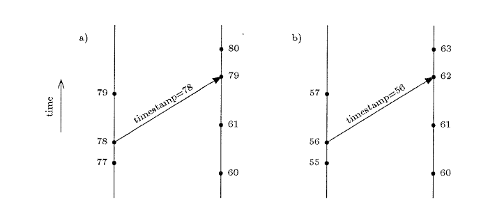

# vector-clock


A PHP implementation of the concept of **Vector Clock** and **Lamport timestamp** as defined in the paper : **Timestamps in Message-Passing Systems That Preserve the Partial Ordering** (paper/vector-clock-paper.pdf).

This library provides :
- Lamport timestamp
- Asynchrone vector clock
- Synchrone vector clock

## Lamport timestamp

### Usage

```php
<?php

$lt1 = new LamportTimestamp(76);
$lt2 = new LamportTimestamp(59);

assertEquals(76, lt1->getValue());
assertEquals(59, lt2->getValue());
assertTrue($lt1->happenAfter($lt2)); // lt2 -> lt1
assertTrue($lt2->happenBefore($lt1));


$lt1->applyLocalEvent();
$lt2->applyLocalEvent();

assertEquals(77, lt1->getValue());
assertEquals(60, lt2->getValue());
assertTrue($lt1->happenAfter($lt2)); // lt2 -> lt1
assertTrue($lt2->happenBefore($lt1));


$lt1ToSend = clone $lt1->applySendEvent();
$lt2->applyLocalEvent();

assertEquals(78, lt1->getValue());
assertEquals(78, $lt1ToSend->getValue());
assertEquals(61, lt2->getValue());
assertTrue($lt1->isIdenticalTo($lt1ToSend)); // lt1 == lt1ToSend
assertFalse($lt2->isIdenticalTo($lt1ToSend)); // lt2 != lt1ToSend

$lt2->applyReceiveEvent($lt1ToSend);

assertEquals(78, lt1->getValue());
assertEquals(79, lt2->getValue());
assertTrue($lt1->happenBefore($lt2)); // lt1 -> lt2
assertTrue($lt2->happenAfter($lt1));

```

In the test case : **LamportTimestampScenarioTest::testPaperFigure1A** and **LamportTimestampScenarioTest::testPaperFigure1B** you can see the full scenario of the paper :



## Asynchrone vector clock


### Usage

```php
<?php

// We create three clocks, one for each node in our system
$clockNode1 = new AsyncVectorClock('NODE-1');
$clockNode2 = new AsyncVectorClock('NODE-2');
$clockNode3 = new AsyncVectorClock('NODE-3');

// Then, for each clock, we add the others nodes in the current vector 

$clockNode1->addNode('NODE-2');
$clockNode1->addNode('NODE-3');

$clockNode2->addNode('NODE-1');
$clockNode2->addNode('NODE-3');

$clockNode3->addNode('NODE-1');
$clockNode3->addNode('NODE-2');

// All clocks must look like [0, 0, 0]
// After the initialization part, we can play with our clocks

$a = (clone $clockProcess1)->applySendEvent(); // [1, 0, 0]
$l = (clone $clockProcess2)->applyLocalEvent(); // [0, 1, 0]
$v = (clone $clockProcess3)->applyLocalEvent(); // [0, 0, 1]


$b = (clone $a)->applyLocalEvent(); // [2, 0, 0]
$m = (clone $l)->applyReceiveEvent($a); // [2, 2, 0]
$w = (clone $v)->applyLocalEvent(); // [0, 0, 3]

// And one more important thing, we can compare clocks

assertTrue($l->canBeComparedWith($v)); 

assertTrue($a->isIdenticalTo($a)); // a == a
assertTrue($l->isConcurrentWith($v)); // l <-> v

assertTrue($m->happenAfter($a)); // a -> m
assertTrue($a->happenBefore($m)); // a -> m
assertTrue($l->happenBefore($m)); // l -> m

```

In the test case : **AsyncVectorScenarioTest::testPaperFigure3** you can see the full scenario of the paper : 


## Synchrone vector clock

### Usage

```php
<?php

// We create three clocks, one for each node in our system
$clockNode1 = new SyncVectorClock('NODE-1');
$clockNode2 = new SyncVectorClock('NODE-2');
$clockNode3 = new SyncVectorClock('NODE-3');

// Then, for each clock, we add the others nodes in the current vector 

$clockNode1->addNode('NODE-2');
$clockNode1->addNode('NODE-3');

$clockNode2->addNode('NODE-1');
$clockNode2->addNode('NODE-3');

$clockNode3->addNode('NODE-1');
$clockNode3->addNode('NODE-2');

// All clocks must look like [0, 0, 0] and are idle (i.e. not in communication with another node)
// After the initialization part, we can play with our clocks

assertTrue($clockNode1->isIdle());
assertTrue($clockNode2->isIdle());
assertTrue($clockNode3->isIdle());

$a = (clone $clockNode1)->applyLocalEvent(); // [1, 0, 0]
$t = (clone $clockNode3)->applyLocalEvent(); // [0, 0, 1]

// Then we want to make a synchrone communication between node1 and node2

$b = clone $a; // [1, 0, 0]
$l = clone $clockNode2; // [0, 0, 0]

$b->applySendEvent($l->getNode());
assertTrue($b->isCommunicating());
assertEquals('NODE-2', $b->getCommunicatingNode());

// $b sends its clock and is in a communicating state
// This means that, if you try to modify the clock you will get a ClockIsNotIdleException
// The only way for $b to become idle again is to receive a clock from NODE-2 (the current node is communicating with)
// As soon as $b receive a clock from NODE-2, it will merge it and go back to idle state and can be modified again

$l->applyReceiveEvent($b); // [2, 1, 0]
$b->applyReceiveEvent($l); // [2, 1, 0]

assertTrue($b->isIdle());

// And one more important thing, we can compare clocks

assertTrue($a->canBeComparedWith($t)); 

assertTrue($a->isIdenticalTo($a)); // a == a
assertTrue($l->isIdenticalTo($b)); // l == b

assertTrue($a->isConcurrentWith($t)); // a <-> t

assertTrue($l->happenAfter($a)); // a -> l
assertTrue($a->happenBefore($b)); // a -> b
assertTrue($a->happenBefore($l)); // a -> l

```

In the test case : **SyncVectorScenarioTest::testPaperFigure7** you can see the full scenario of the paper :


